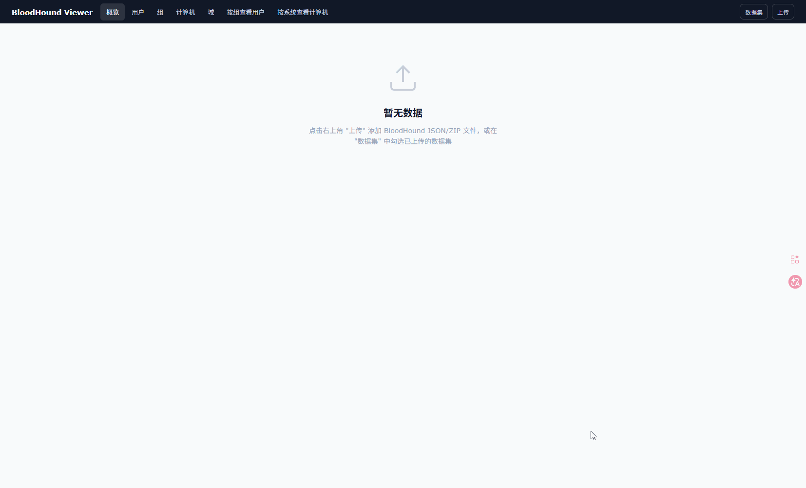

# BloodHound Viewer

一个基于 Node.js + Express 的本地 BloodHound 数据查看器。

它提供了一个无需前端构建的 Web 界面，用来上传、持久化并浏览 BloodHound 导出的 `JSON` / `ZIP` 数据，适用于分析大型内网，可以快速查看用户、组、计算机和域信息。



## 功能特性

- 支持上传 BloodHound 导出的 `JSON` 文件或包含这些文件的 `ZIP` 压缩包
- 支持一次上传多个文件，并自动归并为一个数据集
- 数据集会持久化保存到本地 `data/` 目录，服务重启后仍可继续使用
- 支持多数据集同时勾选加载，并自动合并去重后查看
- 支持给数据集添加备注、批量勾选、取消勾选和删除
- 支持按域筛选数据
- 提供概览页，显示用户、组、计算机、域的统计信息
- 提供表格浏览能力，包括：
  - 全局搜索
  - 列排序
  - 列筛选
  - 字段显示/隐藏
  - 列宽调整
  - 分页
- 提供两个聚合视图：
  - 按组查看用户
  - 按操作系统查看计算机
- 支持查看对象详情与关系信息

## 技术栈

- 后端：Node.js、Express、Multer
- 数据解析：`adm-zip`
- 前端：静态页面 + Vue（直接通过静态资源提供）
- 存储方式：本地 `data/` 目录中的 JSON 文件

## 项目结构

```text
webapp/
├─ data/                  # 已上传并持久化的数据集
├─ src/
│  ├─ config/             # 列配置
│  ├─ lib/                # BloodHound 数据解析与通用工具
│  ├─ routes/             # API 路由
│  ├─ services/           # 上传解析、查询与聚合逻辑
│  ├─ store/              # 数据集持久化与合并逻辑
│  └─ server.js           # 服务入口
├─ static/                # 前端静态资源
├─ package.json
└─ README.md
```

## 环境要求

- 已安装 Node.js
- 已安装 npm

## 安装依赖

```bash
npm install
```

## 启动项目

```bash
npm start
```

启动后默认访问：

```text
http://127.0.0.1:8000
```

如果需要修改端口，可以在启动前设置环境变量 `PORT`。

## 使用说明

### 1. 启动服务

执行：

```bash
npm start
```

### 2. 打开页面

浏览器访问：

```text
http://127.0.0.1:8000
```

### 3. 上传 BloodHound 数据

 点击右上角“上传”，选择以下任一形式的数据：

 - 单个或多个 `*.json` 文件
 - 包含这些 JSON 文件的 `*.zip` 压缩包

 系统不会检测固定文件名格式，而是会根据 JSON 内容自动识别 `users`、`groups`、`computers`、`domains` 类型。

 如果上传的数据中未识别到这些类型的有效内容，系统会提示导入失败。

### 4. 浏览数据

 上传成功后，你可以：

- 在“概览”中查看统计结果
- 在“用户 / 组 / 计算机 / 域”标签中查看表格数据
- 使用“域筛选”缩小结果范围
- 对列进行搜索、筛选、排序和字段显示调整
- 在“数据集”面板中切换已加载的数据集

### 5. 使用聚合视图

 系统还提供两个便于分析的视图：

- “按组查看用户”
- “按系统查看计算机”

### 6. 查看对象详情

 在表格中可进一步查看对象详情以及关联关系，用于继续追踪对象信息。

## 数据持久化说明

- 所有上传后的数据集会保存到根目录下的 `data/` 文件夹
- 服务启动时会自动扫描并重新加载这些数据集
- 删除数据集时，会同时删除对应的持久化文件

## 运行脚本

 `package.json` 当前提供的脚本：

```bash
npm start
```

对应执行：

```bash
node src/server.js
```

## 主要接口概览

 后端 API 挂载在 `/api` 下，核心能力包括：

- `POST /api/upload`：上传并解析数据文件
- `GET /api/datasets`：获取数据集列表
- `PATCH /api/datasets/:datasetId/note`：更新数据集备注
- `DELETE /api/datasets/:datasetId`：删除数据集
- `GET /api/datasets/:datasetId/summary`：获取概览统计
- `GET /api/datasets/:datasetId/data/:dataType`：分页查询表格数据
- `GET /api/datasets/:datasetId/data/:dataType/distinct`：获取某列可筛选值
- `GET /api/datasets/:datasetId/object/*`：获取对象详情
- `GET /api/datasets/:datasetId/users-by-group`：按组查看用户
- `GET /api/datasets/:datasetId/computers-by-os`：按系统查看计算机

 其中 `:datasetId` 支持单个数据集 ID，也支持用英文逗号连接多个数据集 ID 进行合并查看。

## 开发说明

- 这是一个后端与静态前端集成的项目，前端资源直接由 Express 提供
- 当前项目没有单独的前端构建流程，修改 `static/` 下文件后刷新页面即可查看效果
- 服务入口位于 `src/server.js`
- 数据上传、解析与聚合逻辑主要位于：
  - `src/routes/api.js`
  - `src/services/ingest-service.js`
  - `src/services/query-service.js`
  - `src/store/dataset-store.js`

## 下一步计划

 以下内容属于后续规划，当前版本尚未全部实现：

- 补充更多 RPC / 横向关系信息的可视化展示
- 支持显示本地管理员信息（Local Admins）
- 支持显示 RDP 相关权限与可登录关系
- 支持显示 Session 会话信息
- 支持显示 ADCS 相关对象与关系信息
- 在对象详情页与聚合视图中补充上述信息的查询与联动展示

## 常见问题

### 上传后提示未识别到有效数据

 请检查上传文件内容是否为 BloodHound 导出的 JSON，或者确认 ZIP 包中包含的是有效的 BloodHound JSON 文件。

 当前版本不会要求固定文件名，但需要能从文件内容中识别出 `users`、`groups`、`computers`、`domains` 这几类数据。

 ### 重启后数据是否还在

 会保留。上传后的数据集会写入本地 `data/` 目录，服务启动时会自动重新加载。

## 参考项目

- [`ldapdomaindump`](https://github.com/dirkjanm/ldapdomaindump)

  - 本项目在 LDAP / 域数据整理与展示思路上参考了该项目。
- [`BloodHound`](https://github.com/SpecterOps/BloodHound)

  - 本项目的部分图标资源参考了该项目。

## License

 本项目采用 `MIT License`。

 详细内容见仓库根目录下的 `LICENSE` 文件。
